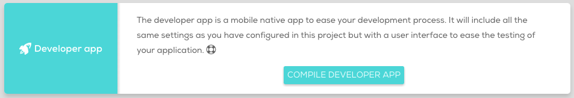

Project configuration
=======================

Once a project is created, it is possible to edit and configure its special settings directly at the cloud. Clicking the name of the project or the settings button in the card of the project will open this project detail page.

Just under the zip dropping area, it is possible to distinguish three different configuration tabs: Settings, Plugins and Config.xml.

## Settings

In this tab it is possible to configure the general settings of the project. It is possible to select the different [webview engines](/webview-engines) for the different platforms and fill easily the different information fields required by the project such as the bundle id, the name and the version.

![[class='center'] Settings](img/settings-tab.png "Settings")

It is possible to override the default settings on each platform, like having different bundle ids for each platform. Remember to save all the changes before compiling. Each modification will modify the config.xml file.

## Plugins  

This tab is a plugin installation helper that will allow the developer to search for a specific plugin in Cordova npm registry and install it on the project.

When a plugin from the list is selected, all the information about it will be shown in the right side of the wizard and the button to install it on the project. It's possible also to select the version of the plugin to be installed. By default, each plugin is installed using the latest version in the registry.

Appart of its installation, it is possible to add different parameters to each plugin configuration, like client IDs, facebook ids, or whatever the plugin requires.

![[class='center'] Plugins installation](img/plugins-wizard.png "Plugins installation menu")

It is possible to check which plugins are installed on each project by clicking the "installed" tab, where it is possible to remove them from the project and edit their configuration.

## Config.xml

When a new project is created, it is possible to include an existing config.xml file or to let the cloud compiler to generate a default one. In addition, it is possible to modify the config.xml locally and the upload the changes to the cloud compiler or to edit the config.xml file directly at the cloud compiler.

### Tags

All tags supported by Cordova are supported by Cocoon too. For more information about this tags, you can visit this <a href=https://cordova.apache.org/docs/en/edge/config_ref/index.html#link-1 target="_blank">section</a> in Cordova documentation.

In the same way, you can configure in the config.xml file all the [icons and Splashes](/user-guide/icons-and-splashes) your project needs.

Cocoon introduces a new tag, starting with the keyword "cocoon". You will see that it is added automatically if you use the [wizard](/user-guide/project-configuration#plugins) to include plugins in your project.

Please, notice that cocoon has also a new namespace that is automatically added to the header of the config.xml. Check the presence of it if you upload a custom config.xml.

#### cocoon:plugin

To add a specific plugin during compilation.

	<cocoon:plugin name="cordova-plugin-name" version="plugin_version" />  

* **name:** *(required)* plugin name.
* **version:** *(optional)* plugin version.

To know more about which plugins are supported, you can visit our [plugins](/plugins) section.

##### Example

	<cocoon:plugin name="cocoon-plugin-ads-android-admob" />

## Developer App  

The developer app will be compiled taking into account the configuration that the project has in the moment when the compilation was triggered. If the project requires plugins not included in the configuration before it, the developer app will be compiled without them.

Remember to save all the configuration changes before compiling a developer app.

More info about the developer app [here](/user-guide/developer-app).
