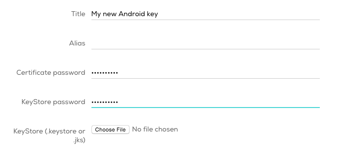
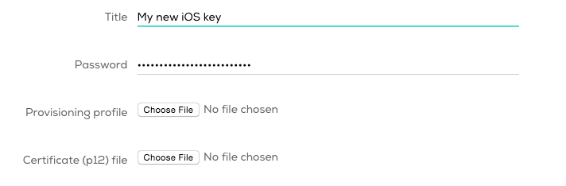
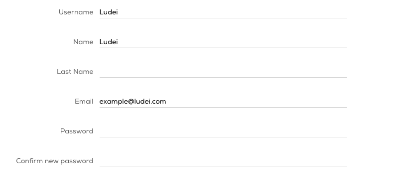

User profile
====================

Once you are logged in, you can access the user profile by clicking your name in the top right corner of the screen.

In the user profile, there are two main tabs: signing keys and profile.

## Signing keys

Each platform requires different settings and files for configuring signing keys.

### Android

Required elements to add a new Android signing key:

* **Title:** *(required)* A title for the new key.

* **Alias:** *(required)* A name you will use when you sign your project.

* **Certificate password:** *(required)*

* **Keystore file:** *(required)* A binary file that contains a set of private keys.

* **Keystore password:** *(required)*

For more information about this settings, you can visit <a href=http://developer.android.com/tools/publishing/app-signing.html target="_blank">Android Developers</a> site.

### iOS

Required elements to add a new iOS signing key:

* **Title:** *(required)* A title for the new key.

* **Password:** *(required)*

* **<a href=https://developer.apple.com/library/ios/documentation/IDEs/Conceptual/AppDistributionGuide/MaintainingProfiles/MaintainingProfiles.html target="_blank">Provisioning profile</a>:** *(required)*

* **<a href=https://developer.apple.com/support/technical/certificates/ target="_blank">Certificate (p12) file</a>:** *(required)*

## Profile

At the user profile tab, it is possible to configure the following information:

* **Username:** *(required)* Shown at the [forums](https://forums.cocoon.io).

* **Name:** *(required)* Your name.

* **Last name:** *(optional)* Your last name.

* **Email:** *(required)* Email in which to receive the logs and notifications.

From the user profile it is also possible to *change your password* and, soon, *upgrade* the user plan.

Remember to read the Terms of Use and Privacy policy and save your changes before leaving the user profile.

### User plans

It will be possible to upgrade your user plan from the user profile. However, at the moment, the only available plan is the free one.

We are already working on offering different options according to the needs of each user. They will be available soon.

<!--## Delete a user account

You can delete your user account whenever you want. However, if a user account is deleted, all data linked to that account will be removed from our servers, including the projects, the source code, the compilations and, of course, the signing keys.

Please, ensure you have a copy of all the relevant data before deleting it, because it can't be recovered. -->
